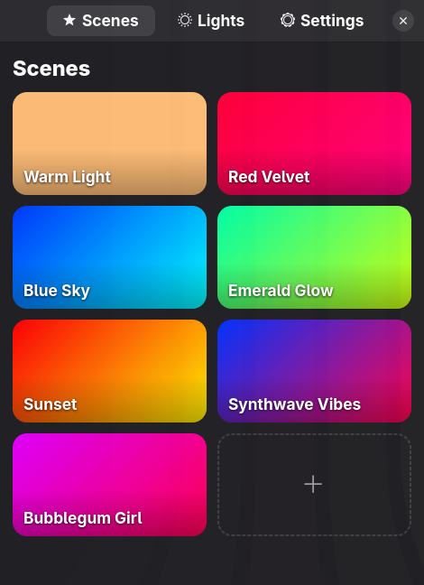
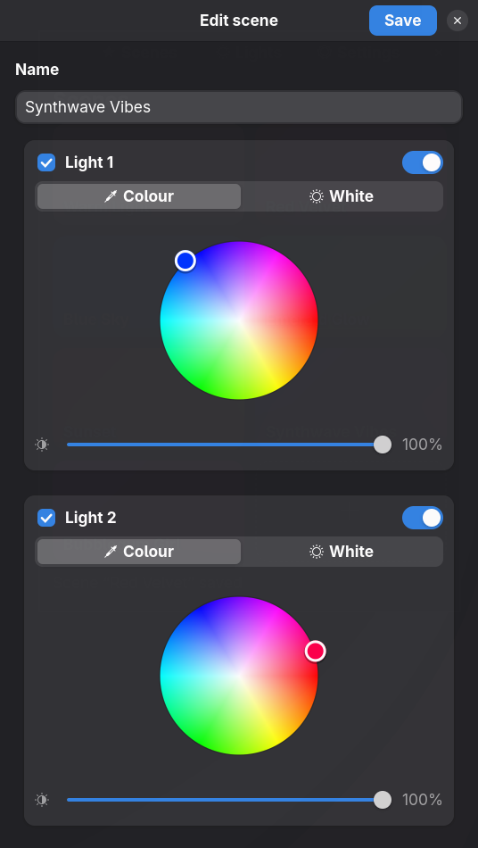

# notuya-gui

**Control your Tuya smart bulbs from the Linux desktop — locally, with no cloud
and no vendor app.**


notuya-gui is a native GTK4 / libadwaita app that talks to your bulbs directly
over the local network. Commands go straight from your desktop to the bulb, so
the lights respond instantly and keep working when the internet — or Tuya's
servers — don't.

<p align="center">
  
  
</p>

## Features

- **Live colour control.** Drag the colour wheel or brightness slider (down
  to 0.1%) and the bulbs follow in real time. Switch to white mode for colour
  temperature, and choose between smooth fades and instant changes. The bulb
  remembers the colour once you leave the Lights tab or quit.
- **Scenes.** Save a look — colour, brightness and power per light — and apply
  it with one click.
- **Screen Sync.** Pick regions of a monitor or window and the bulbs follow
  their average colour live. Requires Hyprland.
- **Guided setup.** A first-run wizard finds bulbs on your network and lets you
  test each one before saving.
- **Local and private.** Nothing is sent to the cloud; device keys stay on your
  machine.
- **Native.** A single binary with a GNOME-style interface — no web view, no
  background service.

## Compatibility

notuya-gui supports Wi-Fi bulbs that use **Tuya local protocol v3.5**, sold
under many brand names and controlled through the Tuya Smart or Smart Life
apps. Your computer must be on the same network as the bulbs.

## Installation

Requires Linux (Wayland), GTK 4, libadwaita, Go 1.27+ and a C compiler.
Everything works on any Wayland compositor except Screen Sync, which needs
Hyprland.

```bash
# Arch Linux / Omarchy
sudo pacman -S --needed go gtk4 libadwaita base-devel

git clone https://github.com/alex-bluetrain/notuya-gui.git
cd notuya-gui
make install    # builds and installs to ~/.local/bin/notuya-gui
```

The first build takes a few minutes while the GTK bindings compile; later
builds are fast.

## Getting started

1. **Launch** `notuya-gui`. On first run, a setup wizard scans your network and
   lists the bulbs it finds.
2. **Enter each bulb's local key.** Tuya bulbs encrypt local traffic with a
   per-device key that is only available from your Tuya account. The
   [tinytuya setup guide](https://github.com/jasonacox/tinytuya#setup-wizard---getting-local-keys)
   explains how to retrieve it. You only need to do this once per bulb.
3. **Test and apply.** *Test* briefly flashes the bulb so you know which is
   which; *Apply* saves your setup.

After that, use **Lights** for everyday control, **Scenes** to save and recall
looks, **Screen Sync** to drive bulbs from your screen, and **Settings** to add
bulbs or update keys.

## Troubleshooting

- **No bulbs found.** Make sure the computer and bulbs are on the same network
  and subnet, and that your firewall allows incoming UDP on ports 6667 and
  7000.
- **Test fails.** Double-check the local key. Keys change whenever a bulb is
  re-paired in the Tuya app, so fetch it again after re-pairing.
- **Bulb keeps dropping and reconnecting.** A bulb accepts only one local
  connection. The Tuya app on the same network, or a tool like tinytuya, fights
  notuya-gui for it and each knocks the other off. Close one of them.

## Development

```bash
make build    # build ./notuya-gui
make check    # go vet + go test
```

The Tuya protocol itself is implemented in
[notuya-go](https://github.com/alex-bluetrain/notuya-go), a separate
dependency-free Go library. To work on both at once, point this module at a
local checkout with a (gitignored) workspace file:

```bash
go work init . ../notuya-go
```

See [CHANGELOG.md](CHANGELOG.md) for release history.
